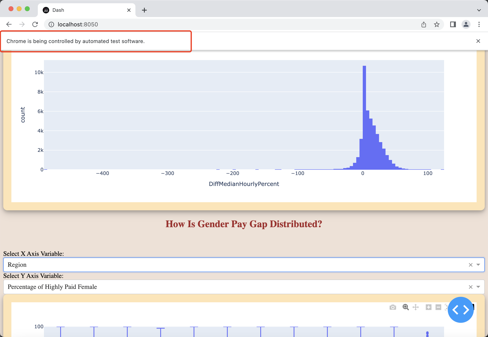
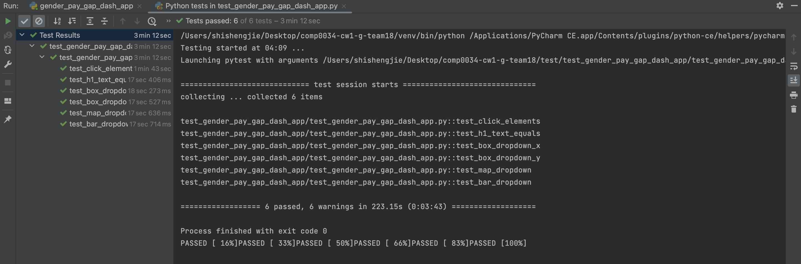
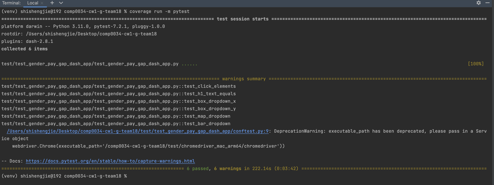
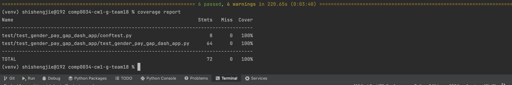
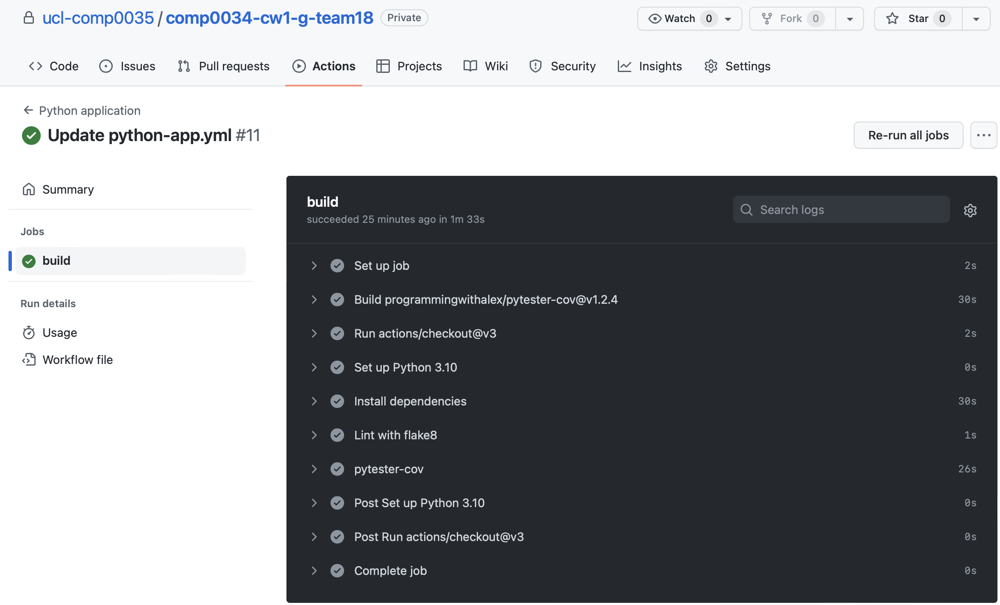

# COMP0034 Coursework 1

This repository is created for COMP0034 Coursework 1 done by Team 18. This README.md will provide a guidance for readers
 / markers to facilitate understanding the contents.

# Set-up instructions

1. URL to your GitHub repo: https://github.com/ucl-comp0035/comp0034-cw1-g-team18.git;
2. Please install all necessary Python packages listed in [requirements.txt](requirements.txt);
3. The [business-need.pdf](business-need.pdf), [requirements.pdf](requirements.pdf) and [design.pdf](design.pdf) documents 
are collected from previous work of the team in COMP0035 last term. These files are used to help understand the context 
and initial design of the Web APP;
4. Browser used to test the Dash created in this coursework is Chrome 109 version and our group members use Mac OS, 
the chromedriver is downloaded to [chromedriver_mac_arm64](test/chromedriver_mac_arm64) directory under [test](test) 
folder. You may need to execute it first before going to testing;
5. The CI workflow was implemented during a early stage of the project but failed attempts were deleted, you may find 
evidences through commit history to show we have regularly used CI approaches.

# 1. Visualisation design

See [VisualizationDesign.pdf](VisualizationDesign.pdf)

# 2. Dash app

The code for the Dash app can be found at [gender_pay_gap_dash_app.py](src/gender_pay_gap_dash_app/gender_pay_gap_dash_app.py).

In order to make the app look more aesthetically pleasing, a CSS [stylesheet](src/gender_pay_gap_dash_app/assets/style.css) 
can be found under [assets](src/gender_pay_gap_dash_app/assets) directory in [src](src). It has managed to change the theme 
color and make visualizations in a card style.

Since visualizations require more complex data structure than we thought before during data processing stage at COMP0035
, further data processing was implemented for this coursework. Code for data processing can be looked at [data_prep.py](data_prep.py)
. Meanwhile, we found it easier to split dataframes that we need when generating visualizations, therefore, we have used 
multiple datasets which can be found in [data](src/gender_pay_gap_dash_app/data) directory under src/gender_pay_gap_dash_app 
directory. The dataset we prepared in COMP0035 is [gender_pay_gap_prepared.csv](src/gender_pay_gap_dash_app/data/gender_pay_gap_prepared.csv) 
while all the remaining spreadsheets are created at this time.

Generally, the APP has met requirements that we intended to achieve as a dashboard showing general information of UK 
gender pay gap situations and target users can obtain information to answers their problems. While the map graphs would 
be better with a Choropleth map, we failed to find a proper geojson of UK, thus were unable to create one. Therefore, we 
have used a scatter_mapbox as a substitute by manually inputting the geographical coordinates (longitude and latitude) of 
each region (shown in [data_prep.py](data_prep.py).

# 3. Testing

In order to perform testing on the developed app, the [gender_pay_gap_dash_app.py](src/gender_pay_gap_dash_app/gender_pay_gap_dash_app.py) 
file, which contains the app code, is put under a directory under src directory. Meanwhile, an [__init__.py](src/gender_pay_gap_dash_app/__init__.py) 
file is created in the same directory. The python file used to write testing code is named as [test_gender_pay_gap_dash_app.py](test/test_gender_pay_gap_dash_app/test_gender_pay_gap_dash_app.py) 
and put in a test directory. The src directory is marked as sources root in PyCharm and the test directory is market as 
test sources root. Meanwhile, a [conftest.py](test/test_gender_pay_gap_dash_app/conftest.py) is also created in the same 
directory as the testing file to include fixtures to be used during testing.

The app was tested with Selenium and Pytest. Meanwhile, other tools including coverage report and continuous integration 
are also used to test the application.

## 3.1 Set Up
### Installing Necessary Packages
In order to test the dash app, we first installed packages including selenium, pytest, pytest-cov, and dash[testing] by 
entering ```pip install pytest selenium pytest-cov dash\[testing]``` in the terminal. It is noted that for some shells 
the dash[testing] package needs to be installed with a \ to escape the open bracket as explained in [dash documentation](https://dash.plotly.com/testing).

### Download and install ChromeDriver
The ChromeDriver for Chrome version 109 was downloaded and installed to our computers by executing the command file. It 
is also put in this repository under test directory.

### Configure in conftest.py
We have created a fixture in conftest.py to set the web driver to ChromeDriver downloaded as mentioned above so that the 
driver configuration can be commonly used for every test in the testing file. Code for creating the fixture:
```ruby
@pytest.fixture
def driver():
    driver = BasePage(
        webdriver.Chrome(executable_path='/comp0034-cw1-g-team18/test/chromedriver_mac_arm64/chromedriver'))
    yield driver
    driver.quit()
```

## 3.2 Tests
We have created 6 test functions with automated testing tool Selenium to test the application end-to-end. The first test 
would automatically run the web app and click every selector of the app in sequence. The second test is used to test whether 
the title of dash matches what was set. The remaining tests are used to validate if the default value of the selector 
is the same as setting. Each test is determined and described with GIVEN-WHEN-THEN approach.

#### Test Function 1: test_click_elements

The first test function test_click_elements aims to open the dash app and click automatically on every selector in sequence. 
To describe it in GIVEN-WHEN-THEN approach:

    """
    GIVEN the dash created in gender_pay_gap_dash_app.py is running
    WHEN the home page is loaded
    THEN Selenium will test the app automatically by clicking every selector in sequence
    """

Code for this test function:
```ruby
def test_click_elements(driver):

    driver.get("http://localhost:8050/")
    time.sleep(15)
    fruit_s = driver.find_elements(By.CSS_SELECTOR, "#histogram-selector label input")
    for fruiti in fruit_s:
        fruiti.click()

    driver.find_element(By.CSS_SELECTOR, '#xaxis_selector').click()
    for x_axis_selector in range(1, 4):
        time.sleep(2)
        x_axis = '.VirtualizedSelectOption:nth-child({})'.format(x_axis_selector)
        driver.find_element(By.CSS_SELECTOR, x_axis).click()
        time.sleep(2)
        driver.find_element(By.CSS_SELECTOR, '#yaxis_selector').click()
        for y_axis_selector in range(1, 4):
            time.sleep(2)
            y_axis = '.VirtualizedSelectOption:nth-child({})'.format(y_axis_selector)
            driver.find_element(By.CSS_SELECTOR, y_axis).click()
            time.sleep(2)
            driver.find_element(By.CSS_SELECTOR, '#yaxis_selector').click()
        time.sleep(2)
        driver.find_element(By.CSS_SELECTOR, '#xaxis_selector').click()

    driver.find_element(By.CSS_SELECTOR, '#map_selector').click()
    for map_selector in range(1, 4):
        time.sleep(2)
        map = '.VirtualizedSelectOption:nth-child({})'.format(map_selector)
        driver.find_element(By.CSS_SELECTOR, map).click()
        time.sleep(2)
        driver.find_element(By.CSS_SELECTOR, '#map_selector').click()

    driver.find_element(By.CSS_SELECTOR, '#bar_selector').click()
    for bar_selector in range(1, 4):
        time.sleep(2)
        bar = '.VirtualizedSelectOption:nth-child({})'.format(bar_selector)
        driver.find_element(By.CSS_SELECTOR, bar).click()
        time.sleep(2)
        driver.find_element(By.CSS_SELECTOR, '#bar_selector').click()
```

#### Test Function 2: test_h1_text_equals
This test was used to validate if the dash title matches what was set as "Gender Pay Gap Situations Visualisation Dashboard". 
In GIVEN-WHEN-THEN approach:

    """
    GIVEN the app is running
    WHEN the homepage is available
    THEN the H1 heading element should be "Gender Pay Gap Situations Visualisation Dashboard"
    """

Code for this test:
```ruby
def test_h1_text_equals(driver):

    driver.get("http://localhost:8050/")
    time.sleep(15)
    h1_element = driver.find_element(By.TAG_NAME, "h1")
    h1_text = h1_element.text
    assert h1_text.casefold() == "Gender Pay Gap Situations Visualisation Dashboard".casefold()
```

#### Test Function 3: test_box_dropdown_x
The test is used to test whether the default value for x-axis selector for the box plot is 'Region'. In GIVEN-WHEN-THEN 
approach:

    """
    GIVEN the Dash app is running
    WHEN the home page has loaded
    THEN 'Region' should be the default at x axis dropdown box of bax plots
    """
Code for this test:
```ruby
def test_box_dropdown_x(driver):

    driver.get("http://localhost:8050/")
    time.sleep(15)
    driver.implicitly_wait(15)
    assert (
            "Region" in driver.find_element(By.CSS_SELECTOR, '#xaxis_selector').text
    )
```

#### test Function 4: test_box_dropdown_y
The test is used to test the default value of y-axis selector dropbox for the box plot graph. In GIVEN-WHEN-THEN approach: 

    """
    GIVEN the Dash app is running
    WHEN the home page has loaded
    THEN 'Percentage of Highly Paid Female' should be the default at y axis dropdown box of bax plots
    """

Code for this test:
```ruby
def test_box_dropdown_y(driver):

    driver.get("http://localhost:8050/")
    time.sleep(15)
    driver.implicitly_wait(15)
    assert (
            "Percentage of Highly Paid Female" in driver.find_element(By.CSS_SELECTOR, '#yaxis_selector').text
    )
```

#### Test Function 5: test_map_dropdown
The test is used to check the default value at dropdown box of the map graph selector. In GIVEN-WHEN_THEN approach:
   
    """
    GIVEN the Dash app is running
    WHEN the home page has loaded
    THEN 'Percentage Difference on Hourly Pay' should be the default at dropdown box selector of map
    """
Code for this test:
```ruby
def test_map_dropdown(driver):

    driver.get("http://localhost:8050/")
    time.sleep(15)
    driver.implicitly_wait(15)
    assert (
            "Percentage Difference on Hourly Pay" in driver.find_element(By.CSS_SELECTOR, '#map_selector').text
    )
```

#### Test Function 6: test_bar_dropdown
The test is used to check the default setting of the dropdown box selector for the bar chart. In GIVEN-WHEN-THEN approach: 

    """
    GIVEN the Dash app is running
    WHEN the home page has loaded
    THEN 'Region' should be the default at dropdown box selector of barchart
    """
Code for this test:
```ruby
def test_bar_dropdown(driver):

    driver.get("http://localhost:8050/")
    time.sleep(15)
    driver.implicitly_wait(15)
    assert (
            "Region" in driver.find_element(By.CSS_SELECTOR, '#bar_selector').text
    )

```

### Running the test
When the test is run by clicking 'run' on PyCharm, the Chrome browser on the computer will be automatically opened and 
the dash app will be shown. There will be a banner showing 'Chrome is being controlled by automated test software.' as 
shown below:


**Note that if running the whole testing file, it may take approximately over 3 minutes for the software to finish 
all tests. Clicking on other windows may cause failure on testing.**

### Test Result
As shown in the image, all tests were successful in 3min 12sec.


## 3.3 Applying Coverage
We have also implemented ```coverage``` python package. We can type ```coverage run -m pytest``` 
in the terminal to run all the test functions and record the coverage information. The result after running coverage is 
shown below:

We can also generate a coverage report by entering ```coverage report``` in the terminal after running coverage. It is 
shown in the image below:

This shows us a summary of the coverage information, including the percentage of code that was executed during the tests and a list 
of the files that were not covered. As we can see in the result above, all codes were passed through the test and all tests 
were successful.

## 3.4 Continuous Integration
Continuous integration (CI) involves developers frequently integrating their code changes into a central repository, 
followed by automated testing and building processes to verify that the code operates as intended. The aim of CI is to 
identify and resolve issues promptly, allowing developers to concentrate on writing new code and incorporating fresh 
functionalities.

Like what we did in COMP0035 Coursework 2, we have created a [workflow](.github/workflows/python-app.yml) on GitHub Actions 
based on Python Application yml file provided on GitHub. However, the default settings reports errors all the time even 
though dash app and tests went properly on IDE. Therefore, we have changed the settings with code from marketplace. The 
screenshot for a successful result is shown below:



